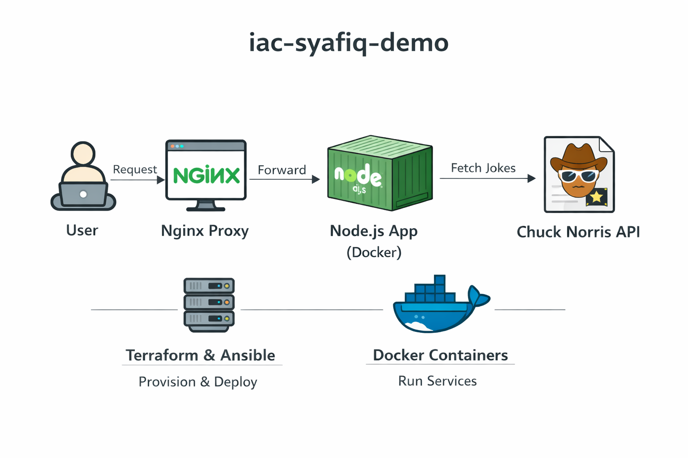

# iac-syafiq-demo

This project deploys a simple web application that shows a random Chuck
Norris joke.

------------------------------------------------------------------------

# What This Project Does

1.  Terraform creates a virtual server in AWS.
2.  Ansible installs Docker on the server.
3.  Docker runs:
    -   The NodeJS application
    -   An NGINX web server in front of it
4.  When you open the server IP in your browser, you see a random Chuck
    Norris joke.

------------------------------------------------------------------------

# Project Structure

    app/            → NodeJS application and Dockerfile
    nginx/          → NGINX configuration
    terraform/      → Infrastructure creation
    ansible/        → Server setup and deployment
    docker-compose.yml

------------------------------------------------------------------------

# Requirements

You need:

-   AWS account
-   SSH key pair
-   Terraform installed
-   Ansible installed

------------------------------------------------------------------------

# Deployment Steps

## Step 1: Create the Server

Go to the terraform folder:

    cd terraform

Initialize Terraform:

    terraform init

Create the infrastructure:

    terraform apply

When finished, Terraform will display the public IP address of the
server. Copy this IP address.

------------------------------------------------------------------------

## Step 2: Configure Ansible

Open:

    ansible/inventory.ini

Replace the placeholder IP with the public IP from Terraform.

------------------------------------------------------------------------

## Step 3: Deploy the Application

Go to the ansible folder:

    cd ansible

Run:

    ansible-playbook -i inventory.ini deploy.yml

This will: - Install Docker - Copy the project files - Build the Docker
image - Start the containers

------------------------------------------------------------------------

# Access the Application

Open your browser and go to:

    http://YOUR_SERVER_PUBLIC_IP

You should see a random Chuck Norris joke.

------------------------------------------------------------------------

# How To Reuse This Project

To deploy another application:

-   Replace the NodeJS app inside the `app/` folder
-   Adjust the Dockerfile if needed
-   Update the NGINX configuration if required

You do not need to change the Terraform or Ansible structure unless
infrastructure requirements change.

------------------------------------------------------------------------

# Clean Up

To destroy the server:

    cd terraform
    terraform destroy

------------------------------------------------------------------------
